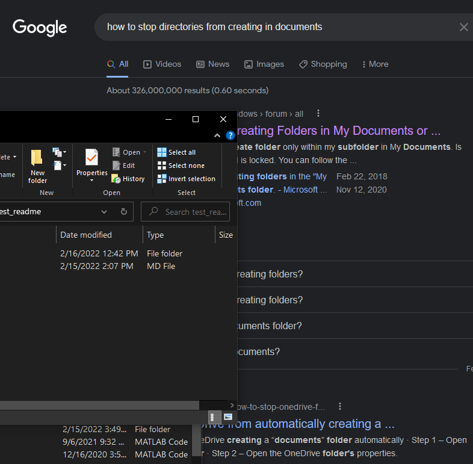

<!-- PROJECT SHIELDS -->

[![MIT License][license-shield]][license-url]
[![LinkedIn][linkedin-shield]][linkedin-url]

<!-- PROJECT LOGO -->
 

  

  <h3 align="center">Ephys GUI</h3>

  

    a gui for analyzing spontaneous EPSC/IPSC data
     
    
  

<!-- TABLE OF CONTENTS -->

  
Table of Contents

  <ol>
    <li>
      <a href="#how-it-looks">How It Looks</a>
    </li>
    <li>
      <a href="#getting-started">Getting Started</a>
    </li>
    <li><a href="#license">License</a></li>
    <li><a href="#contact">Contact</a></li>
    <li><a href="#acknowledgments">Acknowledgments</a></li>
  </ol>

<!-- ABOUT THE PROJECT -->
## How It Looks

Load in your data traces
 

Run template matching algorithm
 

Supervise event detection
 

Extract important features and plot easily
 

 

(<a href="#top">back to top</a>)

<!-- GETTING STARTED -->
## Getting Started

Download the folder, open up the mini_GUI.mat file and click run in MATLAB.

(<a href="#top">back to top</a>)

<!-- LICENSE -->
## License

Distributed under the MIT License. See `LICENSE.txt` for more information.

(<a href="#top">back to top</a>)

<!-- CONTACT -->
## Contact

Brian Cary - [@bcary_neuro](https://twitter.com/bcary_neuro) - dr.bcary@gmail.com

Project Link: [https://github.com/drbcary/tests/test_readme](https://github.com/drbcary/tests/test_readme)

(<a href="#top">back to top</a>)

<!-- ACKNOWLEDGMENTS -->
## Acknowledgments

* 
* 
* 

(<a href="#top">back to top</a>)

<!-- MARKDOWN LINKS & IMAGES -->

[license-shield]: https://img.shields.io/github/license/github_username/repo_name.svg?style=for-the-badge
[license-url]: https://github.com/github_username/repo_name/blob/master/LICENSE.txt
[linkedin-shield]: https://img.shields.io/badge/-LinkedIn-black.svg?style=for-the-badge&logo=linkedin&colorB=555
[linkedin-url]: https://linkedin.com/in/linkedin_username
[product-screenshot]: images/screenshot.png
