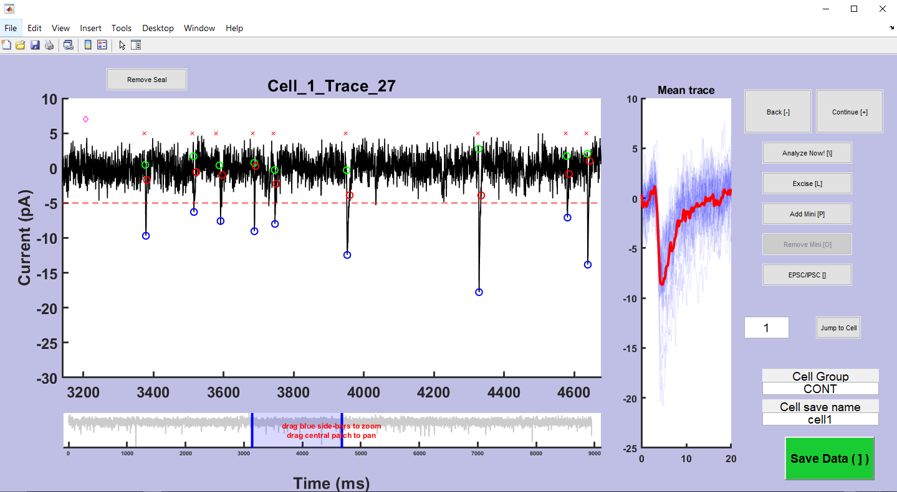

<!-- PROJECT SHIELDS -->

[![MIT License][license-shield]][license-url]
[![LinkedIn][linkedin-shield]][linkedin-url]

<!-- PROJECT LOGO -->
 

  

  <h3 align="center">A GUI for analyzing spontaneous EPSC/IPSC data</h3>

<!-- TABLE OF CONTENTS -->

  
Table of Contents

  <ol>
    <li>
      <a href="#how-it-looks">How It Looks</a>
    </li>
    <li>
      <a href="#getting-started">Getting Started</a>
    </li>
    <li><a href="#license">License</a></li>
    <li><a href="#contact">Contact</a></li>
    <li><a href="#acknowledgments">Acknowledgments</a></li>
  </ol>

<!-- ABOUT THE PROJECT -->
## How It Looks

Load in your data traces
 

Run template matching algorithm
 

Easily zoom into data
 

Supervise event detection by removing/adding events missed by algorithm
 

Extract important features and plot easily
 

 

(<a href="#top">back to top</a>)

<!-- GETTING STARTED -->
## Getting Started

Download the folder (green "Code" button at top then "Download ZIP").

Open the "h5_to_mat" file in MATLAB and run to extract data from wavesurfer h5 files.

Open the mini_GUI.mat file and click run in MATLAB, following directions to find 
the .mat structure file created from h5_to_mat process.

Instructions with more details on how to run the program are in progress.

Feel free to contact me at dr.bcary@gmail.com if you have questions.

(<a href="#top">back to top</a>)

<!-- LICENSE -->
## License

MiniGUI code is not currently licensed.

Waversurfer code included in the "+ws" directory are licensed by HHMI Janelia.
License is included in "WAVESURFER_LICENSE" .txt file in main directory and also
in the "+ws" directory.

Licenses for IBW code, scrollplot, and univarscatter are included in "+utils"

(<a href="#top">back to top</a>)

<!-- CONTACT -->
## Contact

Brian Cary - [@bcary_neuro](https://twitter.com/bcary_neuro) - dr.bcary@gmail.com

Project Link: [https://github.com/drbcary/mini_GUI](https://github.com/drbcary/mini_GUI)

(<a href="#top">back to top</a>)

<!-- ACKNOWLEDGMENTS -->
## Acknowledgments

I want to thank the authors of utilities needed for this program.

(<a href="#top">back to top</a>)

<!-- MARKDOWN LINKS & IMAGES -->

[license-shield]: https://img.shields.io/github/license/github_username/repo_name.svg?style=for-the-badge
[license-url]: https://github.com/github_username/repo_name/blob/master/LICENSE.txt
[linkedin-shield]: https://img.shields.io/badge/-LinkedIn-black.svg?style=for-the-badge&logo=linkedin&colorB=555
[linkedin-url]: https://www.linkedin.com/in/brian-cary-39a631208/
